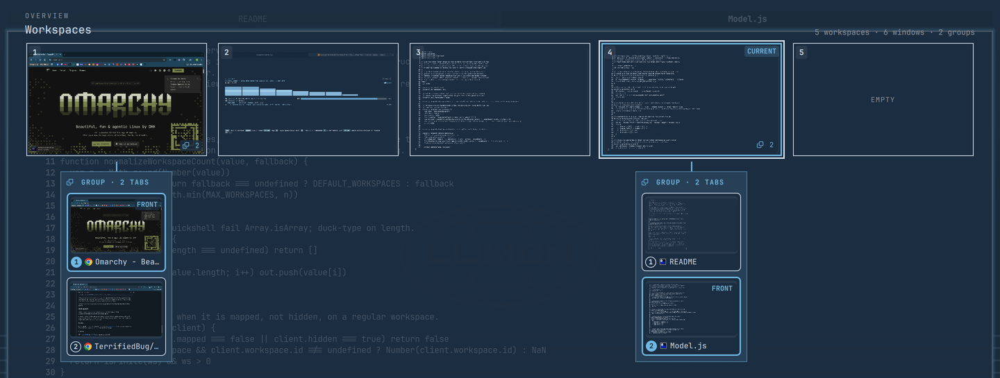

# OmaSpaces

Swipe three fingers up: your workspaces spread out across the screen as live
tiles, and any workspace holding a Hyprland *group* grows a column of that
group's tabs underneath it, each tab with its own live thumbnail. Click a tile
to jump to the workspace, click a card to jump straight to that tab.

Grouped windows are the reason this exists. `SUPER+G` stacks windows into tabs
and Hyprland draws a groupbar of titles above them, in hardcoded white, with no
previews and no theme. Once a group holds more than two windows, the only way
to find the one you want is to cycle through them. OmaSpaces makes the whole
group visible at once, next to the workspaces it lives on.



## Install

```bash
omarchy plugin add https://github.com/TerrifiedBug/omaspaces.git --enable
omarchy restart shell
```

The restart is needed exactly once, so the shell mounts the new overlay; after
that the plugin is live.

The plugin registers the swipe itself, so there is nothing to add to
`~/.config/hypr/input.lua`. A stock Omarchy install leaves three fingers up
unbound, so nothing of yours is taken over. If you already bound swipe-up to
something, set `gesture` to `false` (below) and bind OmaSpaces to whatever you
prefer.

No external dependencies and no privileged step. The plugin is QML loaded into
the Omarchy shell you're already running, plus one `hyprctl` call at startup to
register the gesture.

## Using it

Swipe three fingers up to open the board, swipe again to close it. Click
anywhere outside the tiles, or press `Esc`, to dismiss it.

The board appears when the swipe completes, not while your fingers are moving.
Hyprland calls a Lua gesture action once, at the threshold, and reports no
progress, so there is nothing to animate against. (Plugins that do track the
finger, like `hyprexpo`, are compositor plugins compiled against one exact
Hyprland build; this one survives a Hyprland update.)

| Key            | Does                                                        |
| -------------- | ----------------------------------------------------------- |
| `←` `→`        | Walk the workspace tiles, wrapping at both ends             |
| `↓`            | Drop into the group column under the selected workspace     |
| `↑` `↓`        | Walk the tabs in that column; `↑` at the top returns to the tile |
| `←` `→`        | Inside a column with several groups, hop between them       |
| `1`–`9`        | Jump to the Nth workspace, or the Nth tab inside a column   |
| `Tab` `⇧Tab`   | Same as `→` and `←`                                         |
| `Enter` `Space`| Activate what's selected                                    |
| `Esc`          | Close                                                       |

Hovering a tile or a tab card moves the selection there too, so the keyboard
picks up wherever the pointer left off.

Workspaces you haven't used yet are shown as `EMPTY` and are still clickable,
since Hyprland creates the workspace when you land on it. A workspace above your
configured count shows up as an extra tile at the end when it holds a window.

## Settings

Non-bar plugins keep their settings inline on their `plugins[]` entry in
`~/.config/omarchy/shell.json`. `omarchy bar set` is for bar widgets only, so
this one is a hand edit:

```json
{
  "plugins": [
    { "id": "io.github.terrifiedbug.omaspaces", "workspaces": 5, "gesture": true }
  ]
}
```

| Setting      | Type    | Default | What it does                                              |
| ------------ | ------- | ------- | --------------------------------------------------------- |
| `workspaces` | integer | `5`     | How many workspace tiles to always show (clamped to 1–10)  |
| `gesture`    | boolean | `true`  | Register the three-finger swipe-up at startup              |

`workspaces` applies the next time you open the board. Turning `gesture` on
applies immediately; turning it off applies at the next Hyprland reload or
restart, because Hyprland has no API for removing a gesture once registered.

### Binding it yourself

Any of these summon the board, so you can put it on a key or a different
gesture. In `~/.config/hypr/bindings.lua`:

```lua
o.bind({ "SUPER", "TAB", "Overview", "omarchy-shell shell toggle io.github.terrifiedbug.omaspaces '{}'" })
```

or as your own gesture, in `~/.config/hypr/input.lua`:

```lua
hl.gesture({
  fingers = 4,
  direction = "up",
  action = function()
    hl.dispatch(hl.dsp.exec_raw([[omarchy-shell shell toggle io.github.terrifiedbug.omaspaces '{}']]))
  end,
})
```

Set `gesture` to `false` first if you are replacing the built-in swipe rather
than adding to it.

## How it works

The board comes from Hyprland's own IPC: one `clients` and one `monitors` query
per open, turned into monitors, workspaces and groups. Group membership is the
`grouped` address list every client carries, so a group is identified by its
members instead of by a container, and the tabs appear in the order Hyprland's
groupbar shows them. Windows are placed inside a tile at the fraction of the
monitor they actually occupy, which is what makes the tiles look like the
desktop.

The thumbnails are `ScreencopyView` captures of each window's Wayland toplevel,
live while the board is open. A group's background tabs are mapped but not
visible, and the compositor still hands back real pixels for them, which is the
trick the tab column is built on. If a capture ever comes back empty, the card
falls back to the app icon.

The gesture is registered at startup by the plugin's service with one `hyprctl
repl` call, using Hyprland's Lua state instead of its config file. Registration
is guarded by a Lua global, so restarting the shell doesn't stack a second copy,
and re-registered on `configreloaded` because a config reload rebuilds that
state and drops runtime gestures.

Two IPC calls cover it:

```bash
qs ipc -p "$OMARCHY_PATH/shell" call omaspaces status
qs ipc -p "$OMARCHY_PATH/shell" call omaspaces registerGesture
```

`status` answers `{"gesture":true,"lua":true}`, where `lua` is false on the
legacy `hyprland.conf`, on which `hl.gesture` does not exist and you bind the
summon yourself. `registerGesture` runs the same guarded registrar the service
runs at startup, so it is normally a no-op: it consults the Lua guard, which is
all anyone can consult, since Hyprland will not say whether it still holds a
gesture and has no way to remove one. If the swipe ever goes stale, run
`hyprctl reload`. That clears runtime gestures and the guard together, and the
service registers once more.

## Uninstall

```bash
omarchy plugin remove io.github.terrifiedbug.omaspaces
```

The swipe keeps working until the next Hyprland reload or restart, because
Hyprland cannot unregister a gesture, and with the plugin gone nothing
re-registers it, so it disappears then. `hyprctl reload` clears it immediately.

`omarchy plugin disable io.github.terrifiedbug.omaspaces` does the same thing
temporarily, without deleting anything.

## Hacking on it

Clone it, `omarchy plugin add "file://$PWD" --enable`, and edit the installed
copy in `~/.config/omarchy/plugins/io.github.terrifiedbug.omaspaces`.

Saving a file there logs `Local plugin changed, reloading`, but a `keepLoaded`
overlay and its service are not replaced by that pass, so changes show up after
`omarchy restart shell`. The board model in `Model.js` is Qt-free and testable
without a shell: `node --test test/`.

## License

MIT, see [LICENSE](LICENSE).
